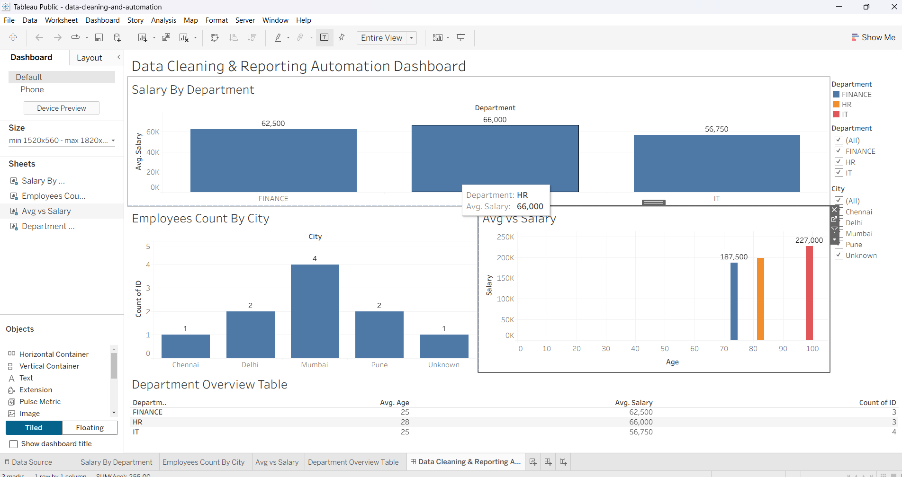

# 📊 Data Cleaning & Reporting Automation Project

## 🧠 Project Overview
This project automates the process of cleaning raw datasets and generating business-ready reports and interactive dashboards. It reduces manual effort in data preprocessing and improves reporting efficiency.

---

## 🎯 Objectives
- Automate data cleaning workflows using Python
- Handle missing values, duplicates, and inconsistent data
- Generate structured analytical reports
- Build interactive Tableau dashboard for visualization

---

## ⚙️ Tech Stack
- Python (Pandas)
- Tableau Public
- Excel (Reporting alternative)
- CSV data processing

---

## 📁 Project Structure
Data-Cleaning-Project/
│
├── data/
│   └── raw_data.csv
│
├── output/
│   └── cleaned_data.csv
│
├── scripts/
│   └── clean_data.py
│
├── dashboard/
│   └── tableau_dashboard.twbx
│
└── README.md

---

## 🔄 Workflow
Raw Data → Python Cleaning → Clean Dataset → Reporting → Tableau Dashboard

---

## 🧹 Data Cleaning Steps
- Handled missing values using mean/mode
- Removed duplicate records
- Standardized text formats
- Cleaned inconsistent data entries

---

## 📊 Key Insights
- Salary comparison across departments
- Employee distribution across cities
- Age vs Salary relationship
- Department-wise analytics

---

## 📈 Dashboard Features
- Interactive filters (Department, City)
- Bar charts and scatter plots
- KPI summary table
- Business-friendly layout

---

## 📷 Dashboard Preview

---

## 🚀 Outcome
This project demonstrates automation in data preprocessing and reporting, improving efficiency and reducing manual work in analytics workflows.

---

## 👨‍💻 Author
Shravya Mididoddi
